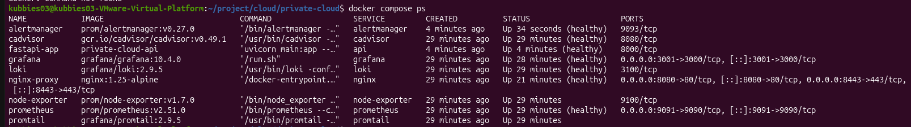
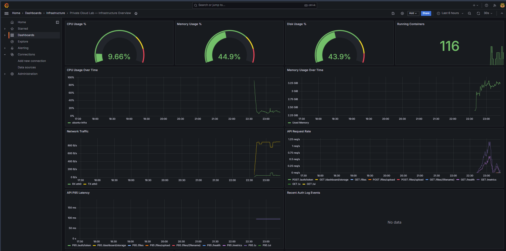
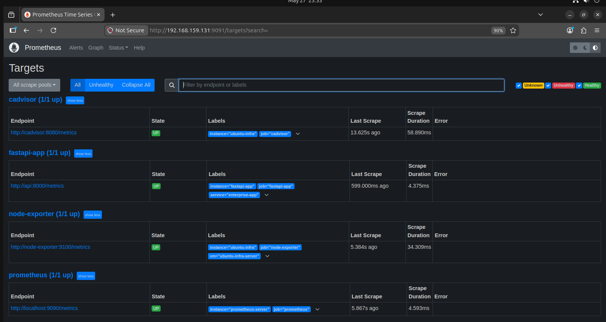
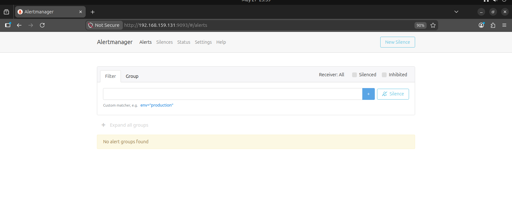
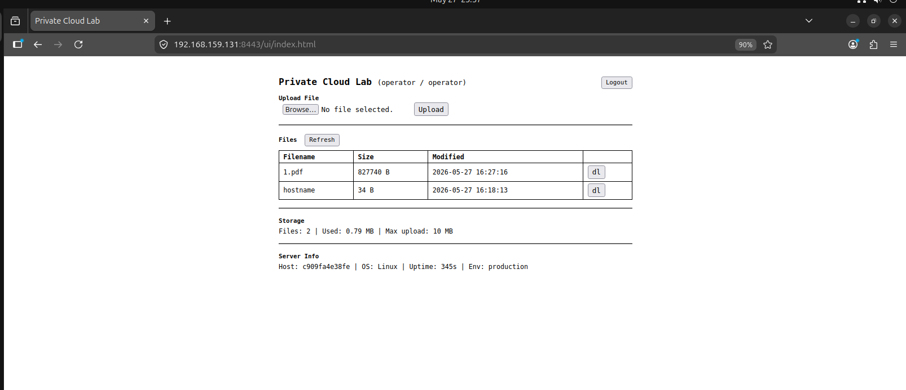

# Enterprise Private Cloud Lab

Self-hosted private cloud on VMware with Ubuntu Server 22.04. Implements production-grade infrastructure patterns: containerized services behind a reverse proxy, full observability stack, security hardening, and automated backup — built and debugged end-to-end.

---

## Screenshots

| Infrastructure | Monitoring |
|---|---|
|  |  |

| Prometheus Targets | Alertmanager |
|---|---|
|  |  |



---

## Architecture

```
VMware Workstation — Host Machine
│
└── 192.168.159.0/24 (NAT Network)
    │
    └── 192.168.159.131  Ubuntu Server 22.04
        ├── Nginx          reverse proxy + SSL termination (TLS 1.2/1.3)
        ├── FastAPI        enterprise app — JWT auth, file storage, /metrics
        ├── Prometheus     metrics collection + alert evaluation (30d retention)
        ├── Alertmanager   alert routing → Slack (#infra-alerts / #infra-critical)
        ├── Grafana        auto-provisioned dashboards
        ├── Loki           centralized log storage (7d retention)
        ├── Promtail       log collection: Docker + syslog + auth.log + nginx
        ├── Node Exporter  host metrics (CPU, RAM, Disk, Network)
        ├── cAdvisor       Docker container metrics
        └── dnsmasq        internal DNS for *.lab.local
```

---

## Tech Stack

| Layer | Technology | Purpose |
|-------|-----------|---------|
| Virtualization | VMware Workstation Pro | Hypervisor |
| OS | Ubuntu Server 22.04 | Guest VM |
| Containers | Docker + Docker Compose | Service orchestration |
| Reverse Proxy | Nginx 1.25 | SSL termination, virtual hosting |
| Application | FastAPI + Uvicorn | Mock enterprise app with metrics |
| Metrics | Prometheus 2.51 + Node Exporter + cAdvisor | Full-stack monitoring |
| Alerting | Alertmanager 0.27 | Alert routing to Slack |
| Dashboards | Grafana 10.4 | Auto-provisioned via JSON |
| Logging | Loki 2.9 + Promtail | Centralized log pipeline |
| DNS | dnsmasq | Internal DNS resolution |
| Security | UFW, Fail2Ban, SSH hardening, sysctl | Defense in depth |
| Backup | Bash + Docker + cron | Automated 7-day retention |

---

## Key Implementation Details

### Networking
- Static IP assignments per container via Docker Compose IPAM (`172.20.0.0/24`)
- Nginx virtual hosts: `api.lab.local`, `grafana.lab.local`, `prometheus.lab.local`
- Internal DNS via dnsmasq — `*.lab.local` resolves across all VMs
- Prometheus internal only (IP allowlist `192.168.159.0/24`)

### Observability
- Prometheus scrapes 4 targets: FastAPI `/metrics`, Node Exporter, cAdvisor, itself
- 5 alert rules: HighCPU (>85%), HighMemory (>85%), DiskSpaceLow (<15%), ContainerDown, APIHighLatency (P95 >1s)
- Alertmanager routes by severity → `#infra-alerts` (warning) / `#infra-critical` (critical)
- Inhibit rules: critical suppresses warning on same instance
- Grafana dashboard auto-provisioned from JSON — no manual setup required
- Loki pipeline: Docker JSON logs + `/var/log/auth.log` + nginx access log with regex label extraction

### Security Hardening
```
UFW:      deny all incoming, allow 22/80/443 + internal monitoring ports
SSH:      PermitRootLogin no, PasswordAuthentication no, MaxAuthTries 3
Fail2Ban: sshd jail (ban 24h / 3 failures) + nginx-http-auth jail
sysctl:   SYN flood protection, source routing disabled, ICMP redirects disabled
Nginx:    TLSv1.2/1.3 only, HSTS, X-Frame-Options, X-Content-Type-Options
```

### Backup
- Daily 02:00: tar configs + Docker volume snapshot via Alpine container
- 7-day retention with automatic cleanup
- Restore script: stops stack → restores configs + volumes → restarts

---

## Project Structure

```
private-cloud/
├── docker-compose.yml              # 9 services, static IPs, healthchecks
├── nginx/
│   ├── conf.d/lab.conf             # Virtual hosts — SSL + proxy rules
│   └── ssl/gen-cert.sh             # Wildcard self-signed cert (SAN)
├── fastapi/
│   ├── Dockerfile
│   └── app/
│       ├── main.py                 # JWT auth (3 roles), file storage, custom metrics
│       └── static/index.html       # Minimal file manager UI
├── prometheus/
│   ├── prometheus.yml              # Scrape configs + alertmanager endpoint
│   └── rules/alerts.yml            # 5 alert rules
├── alertmanager/
│   └── alertmanager.yml            # Slack routing, severity-based channels, inhibit rules
├── grafana/
│   ├── provisioning/               # Auto-provisioned datasources (uid-pinned)
│   └── dashboards/infrastructure.json
├── loki/loki.yml                   # 7-day retention, compactor
├── promtail/promtail.yml           # Docker + syslog + auth + nginx pipeline
├── dns/
│   ├── dnsmasq.conf
│   └── setup-dns.sh                # systemd-resolved integration
├── backup/
│   ├── backup.sh                   # Configs + Docker volumes
│   ├── restore.sh
│   └── setup-cron.sh
└── scripts/
    ├── deploy.sh                   # One-command setup (8 steps)
    ├── security-hardening.sh       # UFW + Fail2Ban + SSH + sysctl
    └── seed-traffic.sh             # Generate demo traffic
```

---

## Deploy

```bash
# On Ubuntu VM
git clone https://github.com/kubbies03/private-cloud.git
cd private-cloud
sudo bash scripts/deploy.sh
```

Deploy script: system update → Docker → SSL cert → DNS → security hardening → `docker compose up -d` → cron

---

## Access

| Service | URL | Credentials |
|---------|-----|-------------|
| File Manager UI | `https://<VM_IP>:8443/ui/index.html` | operator / operator123 |
| API Docs | `https://<VM_IP>:8443/docs` | — |
| Grafana | `http://<VM_IP>:3001` | admin / admin123 |
| Prometheus | `http://<VM_IP>:9091` | — |
| Alertmanager | `http://<VM_IP>:9093` | — |

---

## Alert Demo

```bash
# Trigger ContainerDown alert
docker compose stop api
# → ~1 min: Prometheus fires → Alertmanager → Slack #infra-critical

# Resolve
docker compose start api
# → Slack "Resolved" notification

# Generate load for dashboard
bash scripts/seed-traffic.sh 50
```

---

## Alertmanager — Slack Setup

```bash
# Edit alertmanager/alertmanager.yml
# Replace: https://hooks.slack.com/services/REPLACE/WITH/WEBHOOK
# With your actual webhook URL from https://api.slack.com/apps

docker compose restart alertmanager
```

Required Slack channels: `#infra-alerts`, `#infra-critical`
